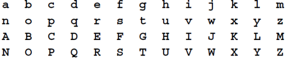
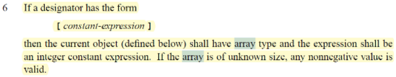
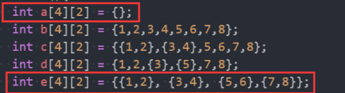
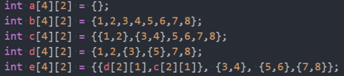

# SysY 语言定义

## **1. SysY** **语言概要**

SysY 语言是本次大赛要实现的编程语言，是 C 语言的一个子集。每个 SysY程序的源码存储在一个扩展名为 sy 的文件中。该文件中有且仅有一个名为 main的主函数定义，还可以包含若干全局变量声明、函数声明和其他函数定义。SysY语言支持 **int** **类型**和元素为 int 类型且按行优先存储的**多维数组类型**，**const** 修饰符用于声明常量。

**函数**：函数可以带参数也可以不带参数，参数的类型可以是 int 或者数组类型；函数可以返回 int 类型的值，或者不返回值(即声明为 void 类型)。当参数为int 时，按值传递；而参数为数组类型时，实际传递的是数组的起始地址，并且形参只有第一维的长度可以空缺。函数体由若干变量声明和语句组成。

**变量/常量声明**：可以在一个变量/常量声明语句中声明多个变量或常量，声明时可以带初始化表达式。所有变量/常量要求先定义再使用。在函数外声明的为全局变量/常量，在函数内声明的为局部变量/常量。

**语句**：语句包括赋值语句、表达式语句、语句块、if 语句、while 语句、break、continue。语句块中可以包含若干变量声明和语句。

**表达式**：支持基本的算术运算（+、-、*、/、%）、关系运算（==、!=、<、>、 <=、>=）和逻辑运算（!、&&、||），非 0 表示真、0 表示假。算符的优先级和结合性与 C 语言一致。

## **2. SysY** **语言的文法**

SysY 语言的文法采用扩展的 Backus 范式（EBNF，Extended Backus-Naur 

Form）表示，其中： 

- 符号[...]表示方括号内包含的为可选项
- 符号{...}表示花括号内包含的为可重复 0 次或多次的项
- 终结符或者是由单引号括起的串，或者是 Ident、InstConst 这样的记号

SysY 语言的文法表示如下，其中 CompUnit 为开始符号：

编译单元       CompUnit $\rightarrow$ \[ CompUnit \](   Decl  |  FuncDef )

声明 $\quad$	    	  	Decl   $ \rightarrow$ ConstDecl $|$ VarDecl 

常量声明  $\quad$ ConstDecl $\rightarrow$ **'const'** BType ConstDef $\{  $','ConstDef \}​ ';'

基本类型     $\quad$ BType $\quad \rightarrow$ **'int'**

常数定义    $\quad$ ConstDef $\rightarrow$ **Ident**   { '[' ConstExp ']' } '=' ConstInitVal

常量初值     ConstInitVal $\rightarrow$ ConstExp  | ' \{ '[ ConstInitVal \{ ',' ConstInitVal\}] '}'

变量声明       $\quad$ VarDecl $\rightarrow$ BType VarDef \{ ',' VarDef } ';'

变量定义         $\quad$ VarDef $\rightarrow$ Ident { '[' ConstExp ']' \}

​												| Ident \{'[' ConstExp ']' } '=' InitVal

变量初值               InitVal $\rightarrow$ Exp| '\{'[ InitVal\{ ','InitVal\}] '}'

函数定义      $\quad$ FuncDef $\rightarrow$ FuncType **Ident** '(' [ FuncFParams ] ')' Block

函数类型    $\quad$ FuncType $\rightarrow$ **'void'** $|$ **'int'**

函数形参表 FuncFParams → FuncFParam { ',' FuncFParam }

函数形参      FuncFParam → BType **Ident** ['[' ']' { '[' Exp ']' }]

语句块                      Block → '{' { BlockItem } '}'

语句块项          BlockItem → Decl | Stmt

语句                           Stmt → LVal '=' Exp ';' 

​												| Exp ';' | Block

​												| '**if**' '( Cond ')' Stmt [ '**else**' Stmt ]

​												| '**while**' '(' Cond ')' Stmt

​												| **'break**' ';' | '**continue**' ';'

​												| '**return**' Exp ';' | '**return**' '; '

表达式                        Exp → Exp BinOp Exp

​												| UnaryOp Exp | '(' Exp ')'

​												| LVal | **Ident** '(' FuncRParams ')' | Number

函数实参表FuncRParams → Exp { ',' Exp }

左值表达式                 LVal → **Ident** {'[' Exp ']'}

条件表达式               Cond → Exp RelOp Exp 

​												| '(' Cond ')' | '!' Cond

​												| Cond '&&' Cond | Cond '||' Cond

关系运算符             RelOp → '==' | '!=' | '<' | '>' | '<=' | '>='

二元算术算符         BinOp → '+' | '−' | '*' | '/' | '%'

单目运算符        UnayrOp → '+' | '−'

常量表达式       ConstExp → ConstExp BinOp ConstExp

​												| UnaryOp ConstExp | '(' ConstExp ')'

​												| Number

数值                    Number → **IntConst**

# **SysY** **语言的终结符特征**

## **1** **、标识符** **Ident**

SysY 语言中标识符 **Ident** 的规范如下(identifier)：

标识符               identifier → identifier-nondigit

​												| identifier identifier-nondigit

​												| identifier digit

其中 identifier-nondigit 为以下之一

**注**：请参考 ISO/IEC 9899 http://www.open-std.org/jtc1/sc22/wg14/www/docs/n1124.pdf 第 51 页关于标识符的定义

第 51 页关于标识符的定义

​	**同名标识符**的约定：

- 全局变量和局部变量的作用域可以重叠，重叠部分局部变量优先；同名局部变量的作用域不能重叠；

- SysY 语言中变量名可以与函数名相同。 

## **2** **、注释**

​	SysY 语言中注释的规范与 C 语言一致，如下：

- 单行注释：以序列 ‘//’ 开始，直到换行符结束，不包括换行符。

- 多行注释：以序列 ‘/*’ 开始，直到第一次出现 ‘*/’ 时结束，包括结束处‘*/’。 

**注**：请参考 ISO/IEC 9899 http://www.open-std.org/jtc1/sc22/wg14/www/docs/n1124.pdf 第 66 页关于注释的定义

## **3** **、数值常量**

SysY 语言中数值常量可以是整型数 **IntConst**，其规范如下（对应 integer const）：

整型常量   integer-const → decimal-const | octal-const 

​												| hexadecimal-const

​                  decimal-const → nonzero-digit | decimal-const digit

​                       octal-const → 0 | octal-const octal-digit

​          hexadecimal-const     hexadecimal-prefix hexadecimal-digit

​												| hexadecimal-const hexadecimal-digit

​         hexadecimal-prefix → ‘0x’ | ‘0X’

​	nonzero-digit 为以下之一

​		**1 2 3 4 5 6 7 8 9**

​	octal-digit 为以下之一

​		**0 1 2 3 4 5 6 7**

​	hexadecimal-digit 为以下之一

​		**0 1 2 3 4 5 6 7 8 9 a b c d e f A B C D E F**

**注**：请参考 ISO/IEC 9899 http://www.open-std.org/jtc1/sc22/wg14/www/docs/n1124.pdf

第 54 页关于整型常量的定义，在此基础上忽略所有后缀。

# **3. SysY** **语言的语义约束**

符合上述文法的程序集合是合法的 SysY 语言程序集合的超集。下面进一步给出 SysY 语言的语义约束。

## **CompUnit** 

编译单元    CompUnit → [ CompUnit ] ( Decl | FuncDef )

声明                      Decl → ConstDecl 

​										   | VarDecl

1. 一个 SysY 程序由单个文件组成，文件内容对应 EBNF 表示中的 CompUnit。在该 CompUnit 中，必须存在且仅存在一个标识为 ‘main’ 、无参数、返回类型为 int 的 FuncDef。该 FuncDef 对应程序入口点。
2. CompUnit 的顶层变量/常量声明语句（对应 Decl）、函数定义（对应 FuncDef） 都不可以重复定义同名标识符（Ident），即便标识符的类型不同也不允许。
3. CompUnit 的变量/常量/函数声明的作用域从该声明处开始到文件结尾。

## **ConstDef**

常数定义       ConstDef → **Ident** { '[' ConstExp ']' } '=' ConstInitVal

1. ConstDef 用于定义常量。ConstDef 中的 Ident 为常量的标识符，在 Ident 后、‘=’之前是可选的数组维度和大小定义部分，在 ‘=’ 之后是初始值。

2. ConstDef 的数组维度和大小定义部分不存在时，表示定义单个变量。此时 ‘=’ 右边必须是单个初始数值。

3. ConstDef 的数组维度和大小定义部分存在时，表示定义数组。其语义和 C 语言一致，比如[2\][8/2\][1*3]表示三维数组，第一到第三维长度分别为 2、4、3。 

   ConstDef 中的这些 ConstExp 都必须求值到非负整数。ISO/IEC 9899http://www.open-std.org/jtc1/sc22/wg14/www/docs/n1124.pdf 第 125 页 6.7.8 节的第

   6 点规定如下：

4. 当 ConstDef 定义的是数组时， ‘=’ 右边的 ConstInitVal 必须是以下两种情况之一：

   a) 一对花括号 {}，表示所有元素初始为 0.

   b) 和多维数组维数和大小完全对应的多个初始值，如{{1,2},{3,4},{5,6}}可作为 a[3\][2]的初始值。

例如：下图中变量 a~e 的声明和初始化都是允许的。

## **VarDef** 

变量定义       VarDef → **Ident**  { '[' ConstExp ']' }

​										| **Ident** { '[' ConstExp ']' } '**=**' InitVal

1. VarDef 用于定义变量。当不含有‘=’和初始值时，其运行时实际初值未定义。

2. VarDef 的数组维度和大小定义部分不存在时，表示定义单个变量。存在时，和 ConstDef 类似，表示定义多维数组。

3. 当 VarDef 含有 ‘=’ 和初始值时， ‘=’ 右边的 InitVal 和 ConstDef 中‘=’ 右边的 CostInitVal 的结构要求相同，唯一的不同是 ConstInitVal 中的表达式是ConstExp 常量表达式，而 InitVal 中的表达式可以是当前上下文合法的任何Exp。

4. VarDef 的数组下标仍然必须是常量表达式，但初始值可以不是，例如下图中的变量 e 的初始化表达式 d[2\][1]。

   

   如下形式的 VarDef / ConstDef 不满足 SysY 语义约束： 

   ​	a[4] = 4

   ​	a[2] = {{1,2}, 3}

   ​	a = {1,2,3}

## **FuncFParam** 

函数形参 FuncFParam → BType **Ident** ['[' ']' { '[' Exp ']' }]

1. FuncFParam 定义一个函数的一个形式参数。当 Ident 后面的可选部分存在时，表示数组定义。当为数组定义时，第一维用方括号[]表示，后面的维需要用表达式指明长度。

2. 数组参数中用于指明长度的表达式使用 Exp 表示而不是 ConstExp，这里 Exp中可以出现前面的形式参数。例如：下图中 prtArray 函数的第二个形参 b 的第 2 维长度为 2*a，其中 a 为函数的第一个形参。

   

## **FuncDef** 

函数定义       FuncDef  → FuncType **Ident** '(' [FuncFParams] ')' Block

1. FuncDef 表示函数定义。其中的 FuncType 指明返回类型。

   a) 当返回类型为 int 时，函数内所有分支都应当含有带有 Exp 的 return 语句。不含有 return 语句的分支的返回值未定义。

   b) 当返回值类型为 void 时，函数内只能出现不带返回值的 return 语句。

2. FuncDef 中的形参列表（FuncFParams）对于函数体相当于变量声明。

## **Block** 

1. Block 表示语句块。语句块会创建作用域，语句块内声明的变量的生存期在该语句块内。

2. 语句块内可以再次定义与语句块外同名的变量或常量（通过 Decl 语句)，其作用域从定义处开始到该语句块尾结束，它隐藏语句块外的同名变量或常量。

## **Stmt** 

1. Stmt 中的 if 类型语句遵循就近匹配。

2. 单个 Exp 可以作为 Stmt。Exp 会被求值，所求的值会被丢弃。

## **LVal** 

1. LVal 表示左值。可以为变量或者某个数组元素。当表示数组时，方括号个数必须和数组变量的维数相同（即定位到元素）。当表示单个变量时，不能出现后面的方括号。

## **Exp** 

1. Exp 中的 LVal，必须是当前作用域内、该 Exp 语句之前有定义的变量或常量。

2. Exp 中的函数调用形式是 Ident ‘(’ FuncRParams ‘)’，其中的 FuncRParams 表示实际参数。实际参数的类型和个数必须与 Ident 对应的函数定义的形参完全匹配。

